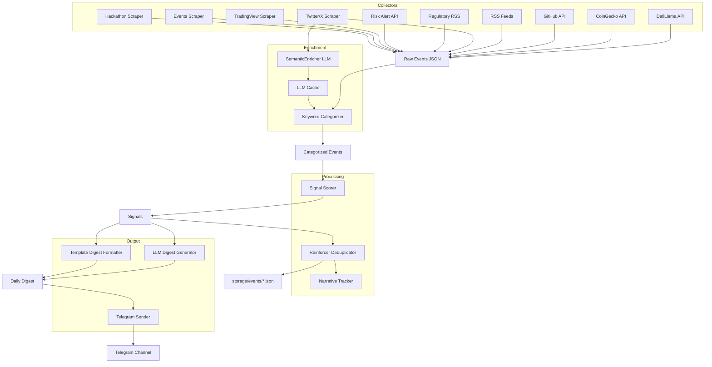
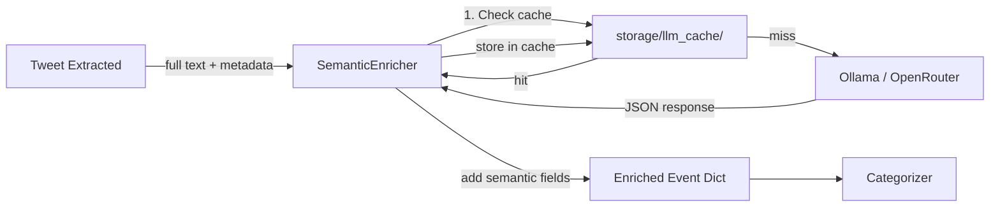
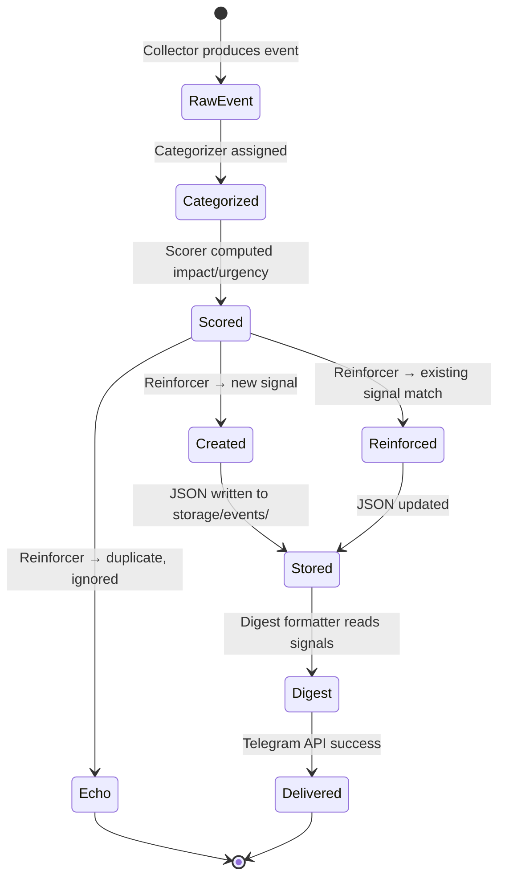
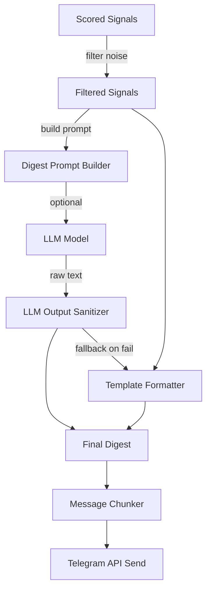
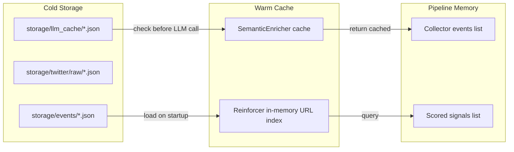

# Chain Monitor — Full System Architecture Document

**Version:** v0.2 (LLM Enhancement Architecture)  
**Date:** 2026-04-26  
**Scope:** 27-chain multi-source intelligence pipeline with LLM-powered semantic categorization and digest generation  
**Author:** 0xminion / System Design  

---

## Table of Contents

1. [Executive Summary](#1-executive-summary)
2. [Design Philosophy](#2-design-philosophy)
3. [System Overview](#3-system-overview)
4. [Data Flow Architecture (Why → How → What)](#4-data-flow-architecture-why--how--what)
5. [Component Reference Architecture](#5-component-reference-architecture)
   - 5.1 Data Ingestion Layer (Collectors)
   - 5.2 Twitter Semantic Enrichment Pipeline (NEW)
   - 5.3 Processing Layer
   - 5.4 Signal Lifecycle Model
   - 5.5 LLM Digest Generation Engine (NEW)
   - 5.6 Delivery Layer
6. [The Twitter Problem Space](#6-the-twitter-problem-space)
7. [Storage & Persistence Architecture](#7-storage--persistence-architecture)
8. [Configuration Architecture](#8-configuration-architecture)
9. [Operational Model](#9-operational-model)
10. [Testing Strategy](#10-testing-strategy)
11. [Extension Points](#11-extension-points)
12. [Mermaid Diagrams](#12-mermaid-diagrams)
13. [API / Interface Reference](#13-api--interface-reference)
14. [Appendix: Category Definitions](#14-appendix-category-definitions)

---

## 1. Executive Summary

Chain Monitor is a strategic intelligence platform that tracks events across 27 blockchain networks and synthesizes them into actionable digests. The system ingests data from 10+ source types (RSS, GitHub, DeFi TVL, on-chain data, regulatory feeds, social media), scores events via an impact/urgency model, enforces deduplication through reinforcement, and delivers narratively-structured outputs via Telegram.

### What this architecture document adds (v0.2)

Two LLM-powered capabilities are introduced:

1. **Twitter Semantic Enrichment**: Every tweet, retweet, and quote-tweet is stored with full content. An LLM reasons over the tweet text (and its thread context if multi-tweet) to assign semantically-grounded category and subcategory labels — replacing keyword-only categorization for the highest-noise source.
2. **LLM-Powered Daily Digest**: Instead of blunt signal enumeration, the digest is generated by an LLM that reads the scored signal set and produces a structured narrative summary. The LLM explains themes, connects related events, and surfaces why the day's events matter to a trader/analyst.

**System quality target:** 95%+ data verification confidence, zero unhandled crashes, <5 minute daily pipeline runtime.

---

## 2. Design Philosophy

### 2.1 Intelligence over Notification
The system is not a news feed. Its output is designed to answer three questions:
- **What happened?** (Signal detection)
- **How much does it matter?** (Impact × Urgency scoring)
- **What should I do about it?** (Trader context per signal, daily theme, weekly narrative velocity)

### 2.2 Semantic over Syntactic
Keyword matching fails on Twitter because short-form text uses slang, irony, abbreviated terminology, and cross-domain metaphors. LLM categorization grounds decisions in semantic meaning rather than string presence.

### 2.3 Categorizing by Source Type
Different sources have different categorization strategies, not because of bias but because of information density:
- **Structured sources** (GitHub releases, DeFiLlama, SEC filings) → deterministic categorization.
- **Semi-structured sources** (RSS, TradingView) → keyword + regex categorization with LLM post-validation.
- **Unstructured sources** (Twitter/X posts) → full LLM semantic categorization with thread context.

### 2.4 Cache-Heavy, Real-Time-Light
The architecture prefers `crawl → store → enrich → query → refresh` over real-time streaming. Events older than 24 hours are rare. This model reduces API costs, avoids rate limits, and makes the system deterministic, testable, and reproducible.

### 2.5 Config-Driven, Code-Light
All chains, scoring baselines, source URLs, and narrative keywords live in YAML. Adding a new chain requires editing two YAML files. No code changes. This is the portability principle the user expects from the system.

### 2.6 Source-Level Observability
Every collector exposes health metrics. The daily digest includes a source-health footer showing which feeds are up, degraded, or down — so a user never wonders "did nothing happen, or is the system broken?"

---

## 3. System Overview

### 3.1 High-Level Pipeline

```
┌──────────────┐    ┌─────────────────┐    ┌──────────────┐    ┌──────────────┐
│  Collectors  │───▶│ Raw Events      │───▶│ Processors   │───▶│   Digests    │
│  (10 types)  │    │ (JSON / Signal) │    │ (4 stages)   │    │ (Daily /     │
└──────────────┘    └─────────────────┘    └──────────────┘    │  Weekly)     │
         │                    │                   │              └──────────────┘
         ▼                    ▼                   ▼                     │
  ┌───────────┐      ┌──────────────┐   ┌──────────────┐              ▼
  │ Per-chain │      │ Semantic     │   │ Reinforcement│       ┌──────────────┐
  │ config    │      │ Enrichment   │   │ & Deduplication    │ Telegram     │
  │ (YAML)    │      │ (LLM)        │   │              │       │ Sender       │
  └───────────┘      └──────────────┘   └──────────────┘       └──────────────┘
```

### 3.2 Technology Stack

| Layer | Technology | Why |
|-------|-----------|-----|
| Language | Python 3.11+ | Ecosystem, async support, dataclasses |
| Scraping | Playwright (Chromium persistent context) | JavaScript-rendered sites, login/cookie support |
| Anti-detection | Camoufox (fallback) | Cloudflare bypass, human-like fingerprint |
| HTTP API | aiohttp | Async HTTP for Telegram sender, API collectors |
| Data | JSON on filesystem (storage/) | Simplicity, inspectability, zero infra dependency |
| Locking | filelock | Safe concurrent access to JSON state |
| LLM API | Ollama (local) / OpenRouter (cloud) | Configurable per-model, cost control, fallback |
| Scheduling | systemd timer / cron / cronjob skill | Deterministic, stateless execution |
| Config | YAML | Human-readable, supports comments, deep nesting |
| Testing | pytest + pytest-asyncio | Unit, integration, async coverage |
| CI | GitHub Actions | Runs all 269+ tests on push/PR |

---

## 4. Data Flow Architecture (Why → How → What)

### 4.1 Why Each Stage Exists

| Stage | Purpose | Failure Mode Mitigation |
|-------|---------|------------------------|
| **Collection** | Gather data from heterogeneous sources | Per-collector try/except; health tracked per source |
| **Semantic Enrichment** | Replace brittle keyword matching with LLM reasoning | Keyword fallback if LLM unavailable; cached results |
| **Categorization** | Assign canonical category + subcategory | Configurable keyword maps; LLM override for Twitter |
| **Scoring** | Quantify impact and urgency | Baseline-driven thresholds; chain-specific overrides |
| **Reinforcement** | Deduplicate and merge signals | URL-based + Jaccard similarity; URL index for speed |
| **Digest Generation** | Summarize signals into cohesive output | LLM summary with fallback to template-based rendering |
| **Delivery** | Send digest to Telegram | Exponential backoff retry; message splitting |

### 4.2 How Data Flows

#### Step 1 — Collection (Parallel, async-naive but sequentially executed)

```
main.py → run_collectors()
    For each collector:
        Run .collect() → returns list[dict] (raw events)
        Capture .get_health() → health[]
        Capture .get_feed_health() → feed_health[]
```

Collectors are NOT parallelized today. The runtime is dominated by Playwright scraping (Events + Twitter) and API latency (GitHub, CoinGecko). The sequential model is sufficient because:
- API calls are batched and cached where possible.
- Playwright instances are heavy (one browser per collector); parallel would exhaust memory.
- Total runtime on a modern box is < 5 minutes.

#### Step 2 — Semantic Enrichment (NEW — Conditional LLM pass)

```
For each event in raw_events:
    if event["source"] == "twitter" and event.get("semantic_enrichment", False) is False:
        Run SemanticEnricher.enrich(event)
            → LLM prompt: "Given this tweet and its thread context, categorize into one of..."
            → Returns: category, subcategory, confidence, reasoning
        Store full tweet content + LLM result in event["semantic"]
```

#### Step 3 — Processing Pipeline

```
For each event:
    1. Categorizer.categorize(event)
         → If event has semantic result AND confidence >= 0.75: use LLM category
         → Else: use keyword-based categorizer
    2. Scorer.score(categorized_event) → Signal
    3. Reinforcer.process(signal) → (signal, "created" | "reinforced" | "echo")
    4. NarrativeTracker.record_signal(signal) [if not echo]
```

#### Step 4 — Digest Generation (NEW — LLM-powered)

```
DailyDigestFormatter.format(signals, health, ...)
    1. Filter to non-noise signals (score >= 3, age <= 24h)
    2. If LLM_DIGEST_ENABLED:
         → Build prompt with signal summaries, chain info, health metrics
         → Call LLM for summary generation
         → Parse and format into Telegram-compatible Markdown
    3. Else: use template-based formatter (legacy mode)
```

#### Step 5 — Delivery

```
TelegramSender.send(digest)
    → Split into chunks <= 4096 chars
    → POST to Telegram Bot API
    → Retry with exponential backoff on 429/5xx
```

### 4.3 What the Data Looks Like at Each Stage

| Stage | Example Data Shape |
|-------|-------------------|
| Raw (Twitter) | `{"tweet_id": "...", "text": "...", "chain": "ethereum", "is_retweet": false, ...}` |
| Enriched | Above + `{"semantic": {"category": "TECH_EVENT", "subcategory": "upgrade", "reasoning": "EIP-4844 mentioned with rollout timeline", "confidence": 0.92}}` |
| Signal | `Signal(id="sha256...", chain="ethereum", category="TECH_EVENT", impact=4, urgency=2, priority_score=8, ...)` |
| Digest | `"📊 Chain Monitor — Apr 26, 2025\n\n🧠 Today's theme...\n🔴 Critical..."` |
| Delivery | `{"ok": true, "result": {"message_id": 12345, ...}}` |

---

## 5. Component Reference Architecture

### 5.1 Data Ingestion Layer (Collectors)

Located in `collectors/`. All inherit from `BaseCollector`.

| Collector | Source Type | Auth | Method | Output Category | Quality |
|-----------|-------------|------|--------|-----------------|---------|
| `DefiLlama` | REST API | None | aiohttp GET | `FINANCIAL` (TVL, fees, revenue, protocol list) | ⭐⭐⭐⭐⭐ |
| `CoinGecko` | REST API | API key | aiohttp GET | `FINANCIAL` (price, mcap, volume anomaly) | ⭐⭐⭐⭐ |
| `GitHub` | REST API | Token | GitHub API | `TECH_EVENT` (releases, high-signal PRs) | ⭐⭐⭐⭐⭐ |
| `RSS` | RSS/Atom | None | feedparser | All categories | ⭐⭐⭐⭐ |
| `Twitter` | X.com | Cookie | Playwright | All (via LLM enrichment) | ⭐⭐⭐ |
| `Regulatory` | RSS | None | feedparser | `REGULATORY` | ⭐⭐⭐⭐ |
| `RiskAlert` | REST API | None | aiohttp GET | `RISK_ALERT` | ⭐⭐⭐⭐⭐ |
| `TradingView` | Web | None | Playwright | All categories | ⭐⭐⭐ |
| `Events` | Web/JSON | None | Playwright+aiohttp | `VISIBILITY` | ⭐⭐⭐⭐ |
| `HackathonOutcomes` | Web | None | Playwright | `VISIBILITY` | ⭐⭐⭐ |

#### Collector Lifecycle

```python
class BaseCollector:
    def __init__(self, name: str):
        self.name = name
        self.health = CollectorHealth()

    def collect(self) -> list[dict]:
        """Must be implemented by subclass. Returns raw event dicts."""
        raise NotImplementedError

    def get_health(self) -> dict:
        return {"status": self.health.status, "last_run": ..., "failures_24h": ...}
```

### 5.2 Twitter Semantic Enrichment Pipeline (NEW)

This is the first new major component. It lives in `processors/semantic_enricher.py`.

#### Why keyword categorization fails on Twitter

Twitter posts are:
- **Short**: < 280 chars, leaving insufficient keyword signal.
- **Colloquial**: "wen mainnet" is semantically equivalent to "mainnet launch" but contains none of the canonical keywords.
- **Context-dependent**: A retweet of an official announcement carries the same signal as the original but with different surface text.
- **Threaded**: Single tweets are fragments. Semantic meaning is distributed across a thread.
- **Cross-domain**: AI infra chains talk about LLM models in language DeFi-native keyword maps don't capture.

#### Design

```
┌──────────────────┐     ┌─────────────────────┐     ┌──────────────────────┐
│ Raw tweet dict   │────▶│  SemanticEnricher   │────▶│ Enriched event dict  │
│ (single or       │     │                     │     │ (category +          │
│  thread batch)   │     │ 1. If thread:       │     │  reasoning +         │
└──────────────────┘     │    concatenate text  │     │  confidence)         │
                       │ 2. Build LLM prompt │     └──────────────────────┘
                       │ 3. Call Ollama/    │              │
                       │    OpenRouter      │              ▼
                       │ 4. Parse JSON      │     ┌─────────────────────┐
                       │    response        │     │ Categorizer reads   │
                       │ 5. Cache result    │────▶│ semantic[] to     │
                       │    (7-day TTL)     │     │ select category     │
                       └─────────────────────┘     └─────────────────────┘
```

#### Prompt Design

The prompt is deterministic, structured, and self-scoring.

```
You are an expert crypto-industry analyst. Given a tweet (and optionally its thread context),
classify it into exactly one of the following categories and subcategories.

Categories:
- RISK_ALERT (hack, exploit, outage, critical bug, vulnerability)
- REGULATORY (SEC action, license, bill, enforcement, policy)
- FINANCIAL (funding, TVL milestone, airdrop, TGE, token sale)
- PARTNERSHIP (integration, deployment, collaboration, alliance)
- TECH_EVENT (mainnet, testnet, upgrade, hard fork, EIP, release, audit)
- VISIBILITY (conference, hackathon, AMA, keynote, hire, departure)
- NOISE (gm, wen, engagement bait, no substantive content)
- NEWS (general crypto news not fitting above)

Subcategories (per category):
{include SUBCATEGORY_MAP}

Rules:
1. Categorize by semantic content, not keyword presence.
2. A "wen mainnet" reply to a mainnet announcement is VISIBILITY, not TECH_EVENT.
3. A retweet of official news inherits the original's category.
4. Funding announcements with amounts >= $1M receive FINANCIAL.
5. "Audit complete" without findings → TECH_EVENT. "Audit finding" → RISK_ALERT.
6. Only return the specified JSON. No extra text.

Input:
Chain: {chain}
Author: {handle} ({role})
Text: {text}
Is retweet: {is_retweet}
Original author: {original_author}
Quoted text: {quoted_text}
Thread context: {concatenated_thread_text if available, else "N/A"}

Output format (strict JSON):
{
  "category": "<CATEGORY>",
  "subcategory": "<subcategory>",
  "confidence": <0.0-1.0>,
  "reasoning": "<1 sentence explaining the classification>",
  "is_noise": <true/false>,
  "primary_mentions": ["<chain1>", "<chain2>"]
}
```

#### Model Configuration

```yaml
# Added to .env / config
LLM_PROVIDER=ollama                    # ollama | openrouter
LLM_MODEL=minimax-m2.7:cloud          # Model for semantic enrichment
LLM_FALLBACK_MODEL=gemma4:31b-cloud    # Fallback if primary unavailable
LLM_DIGEST_MODEL=glm-5.1:cloud         # Model for digest generation
LLM_TEMPERATURE=0.1                    # Low temp for deterministic categorization
LLM_TIMEOUT=30                       # Seconds
LLM_CACHE_TTL_HOURS=168              # Cache semantic results for 7 days
LLM_DIGEST_ENABLED=true              # Enable LLM digest generation
```

#### Caching

Semantic enrichment is cached at `storage/llm_cache/{tweet_id}.json`. The cache key is a hash of `tweet_id + text + author`. Cache TTL: 7 days. This means:
- Re-scraping the same tweet in a 24h window costs zero LLM tokens.
- The categorizer can fall back to cached results even if the LLM service is temporarily down.

#### Fallback Chain

```
1. Try primary model (minimax-m2.7:cloud via Ollama)
2. If timeout or 5xx: try fallback model (gemma4:31b-cloud)
3. If both fail: use keyword-based categorizer as final fallback
4. Log failure in source_health so user knows categorization degraded
```

### 5.3 Processing Layer

#### Categorizer (`processors/categorizer.py`)

The categorizer is not a naive keyword matcher. It is a **rules engine** with LLM override.

```
Input: event dict (may contain semantic enrichment)
Logic:
  if event.source == "twitter" and event.semantic.confidence >= 0.75:
      return event.semantic.category, event.semantic.subcategory
  elif event.semantic.exists and event.semantic.confidence >= 0.50:
      # Use LLM category as vote alongside keyword result
      keyword_cat = keyword_categorize(event)
      if keyword_cat != event.semantic.category:
          # Discord: LLM wins on ambiguous, keyword wins on strong signal
          if event.semantic.is_noise and keyword_is_noise(event):
              return "NOISE", "noise_phrase"
          if event.semantic.confidence >= 0.85:
              return event.semantic.category, event.semantic.subcategory
      return keyword_cat, keyword_subcategory
  else:
      return keyword_categorize(event), keyword_subcategory(event)
```

Key design decisions:
- **Keyword maps are additive, not primary**: They serve as baselines and fallbacks, never as the sole source of truth for high-entropy content.
- **Noise detection is layered**: Twitter noise phrases → short + no substance → LLM `is_noise` flag. Three gates must agree before a tweet is dropped.

#### Scorer (`processors/scoring.py`)

Scoring is quantitative and deterministic. No LLM involvement — categorization quality must be independent of score variability.

```
Score = Impact × Urgency
Impact: 1 (routine) → 5 (critical)
Urgency: 1 (monitor) → 3 (immediate)
Result: 1-15 (mapped to tiers: >=8 critical, >=5 high, >=3 medium)
```

Chain-specific overrides in `config/baselines.yaml` allow per-chain weighting. Example: Hyperliquid regulatory events get baseline floor impact=5 because regulatory clarity is its single biggest risk.

#### Reinforcer (`processors/reinforcement.py`)

The reinforcement engine is a deduplication and confidence-boosting system.

```
URL Index (dict):
  normalized_url → signal_id

Text Similarity:
  Jaccard index on cleaned word sets
  threshold: 0.60 for match, 0.85 for echo

Confidence Boosting:
  source_count = number of distinct sources reporting same event
  multiplier: 1.15 (2 sources), 1.25 (3+ sources)
  official source bonus: +0.05
  cap: 0.95
```

Storage is JSON files in `storage/events/{signal_id}.json`, protected by filelock. This design was chosen over SQLite because:
- Signals are append-only and independently addressable.
- Inspection means `cat storage/events/*.json` — no SQL client needed.
- No schema migration complexity; JSON dicts are backward-compatible.

### 5.4 Signal Lifecycle Model

```
         Raw Event
             │
             ▼
    ┌──────────────┐
    │ Categorize   │ ──► NOISE? ──► discard
    └──────────────┘
             │
             ▼
    ┌──────────────┐
    │ Score        │ ──► Score < 1 ──► discard (log only)
    └──────────────┘
             │
             ▼
    ┌──────────────┐
    │ Reinforce    │ ──► Created / Reinforced / Echo
    └──────────────┘              │
             │                    │
             ▼                    ▼
    ┌──────────────┐      ┌──────────────┐
    │ Store JSON   │      │ Update JSON  │
    │ (new signal) │      │ (append src) │
    └──────────────┘      └──────────────┘
             │
             ▼
    ┌──────────────┐
    │ Digest Gen   │
    └──────────────┘
             │
             ▼
    ┌──────────────┐    ┌──────────────┐
    │ Daily Digest │    │ Weekly Digest│
    └──────────────┘    └──────────────┘
```

### 5.5 LLM Digest Generation Engine (NEW)

This is the second new major component. It lives in `output/daily_digest.py` and is gated by `LLM_DIGEST_ENABLED`.

#### Why Template-Based Digests Are Insufficient

The current formatter produces structured but blunt output: bullet points grouped by score tier. It answers "what happened" but not "why today matters." An LLM summary can:
- Synthesize a unifying theme across disparate events.
- Draw connections (e.g., "Three L2s announced mainnet this week — this is a broader 'L2 maturity' narrative").
- Prioritize signals for the reader, not just enumerate them.
- Write in prose that is faster to parse than bullet lists.

#### Prompt Design

The digest prompt is a structured instruction with embedded signal data.

```
You are a senior crypto market analyst writing a daily intelligence brief.
Your audience is busy traders and analysts who need actionable insights in under 60 seconds.

## Input Data
Date: {date}
Total signals: {count}
High-priority signals (score >= 5): {high_prio_signals}
Critical signals (score >= 8): {critical_signals}

Signals:
{forEach signal:
  - Chain: {chain}
  - Category: {category}
  - Description: {description}
  - Score: {priority_score}
  - Trader context: {trader_context}
  - Sources: {sources}
}

Source Health: {healthy}/{total} healthy collectors

## Output Rules
1. Write in Telegram Markdown. Use **bold** for emphasis, not # headers.
2. Start with a 2-sentence theme summary ("Today"s theme: ...").
3. Group related signals under thematic headings (e.g., "Mainnet Launches", "Regulatory Pressure").
4. For each group, explain WHY it matters — not just WHAT happened.
5. End with a "Watch" section listing 2-3 upcoming items or follow-ups.
6. Total output: 200-400 words.
7. If no high-priority signals, say so and briefly mention any notable low-priority activity.
8. Do NOT include any raw URLs as text — embed them as [text](url) Markdown links.
9. Never use HTML tags. Never use all-caps headings.
```

#### Two-Mode Digest Rendering

```
if LLM_DIGEST_ENABLED and LLM available:
    digest = LLMDigestGenerator.generate(signals, health)
    # Post-process: validate Markdown, ensure chunkable, strip unsupported tags
    digest = LLMDigestSanitizer.sanitize(digest)
else:
    digest = TemplateDigestFormatter.format(signals, health)
```

The template formatter is retained as a **reliable fallback** — zero external dependencies, deterministic output. The LLM generator is preferred when available.

#### Model Configuration

```yaml
# Added to .env / config
LLM_DIGEST_PROVIDER=ollama
LLM_DIGEST_MODEL=glm-5.1:cloud
LLM_DIGEST_TEMPERATURE=0.4           # Slightly higher for creative synthesis
LLM_DIGEST_MAX_TOKENS=1500
LLM_DIGEST_TIMEOUT=45
```

#### Weekly Digest Integration

The weekly formatter (`output/weekly_digest.py`) receives the same treatment:
- Narrative synthesis via LLM rather than category-count enumeration.
- "Narrative of the Week" is LLM-generated prose, not a template string.
- Velocity and convergence flags remain LLM-free (they are quantitative and must be deterministic).

### 5.6 Delivery Layer

#### TelegramSender (`output/telegram_sender.py`)

```
Send flow:
1. Split message into chunks <= 4096 chars (Telegram limit)
2. Prefer splitting at newlines; hard-split oversized lines
3. Add [N/M] prefix for multi-chunk messages
4. POST with Markdown parse mode, disable_web_page_preview: true
5. Handle 429 with Retry-After; 5xx with exponential backoff (2^attempt s)
6. Close aiohttp session on completion
```

Health signals from failed sends are propagated back to `source_health` so a failing Telegram delivery shows up in the next digest's health footer.

---

## 6. The Twitter Problem Space

### 6.1 Current State (v0.1)

Twitter collection uses Playwright with tiered anti-detection:
1. Camoufox (anti-detect)
2. Chromium persistent context (with local Chrome profile)
3. Plain Chromium + cookie injection

Timeline extraction is pure JavaScript evaluation on the DOM:
```javascript
// Extracts: text, timestamp, metrics (replies, retweets, likes)
// Detects: retweet, quote tweet, media URLs
// Limit: 100 tweets per account, 12-20 scrolls, ~24h lookback
```

Content is persisted to:
- `storage/twitter/raw/tweets_{timestamp}.json` — raw extraction
- `storage/twitter/summaries/twitter_summary_{YYYY-MM}.md` — human-readable markdown

### 6.2 Desired State (v0.2)

Every tweet is enriched with semantic understanding before it enters the pipeline.

#### Thread Context Preservation

The current scraper extracts tweets individually. For v0.2, the scraper will optionally:
- Detect if a tweet is a thread starter (text ends with `1/n`, `thread`, `🧵`).
- Follow reply chains by clicking "Show replies" or navigating to the status page.
- Concatenate thread text into a single context blob for LLM analysis.
- Store the thread as a single enriched unit, not N individual tweets.

**Note:** Thread following is expensive (additional page loads). Implementation will gate this with `TWITTER_THREAD_DEPTH` env var (default: 0 = disabled, 1-3 = follow N levels). In production, thread following may be limited to official accounts only.

#### Full Content Storage

All tweet attributes are stored, not just text:
- Full text (no truncation)
- Media URLs (images, videos)
- Engagement metrics (for future scoring weighting)
- Thread relationship map (parent_id, reply_to_id)
- LLM categorization result (category, subcategory, reasoning, confidence)

#### Retweet / Repost Semantics

Retweets are NOT dropped. They are scored using the reliability model:
- Official account retweet → inherits original author's reliability (0.95).
- Contributor retweet of official account → boosted to 0.95.
- Contributor retweet of unknown → standard contributor reliability (0.6-0.8).

### 6.3 Twitter Data Model (v0.2)

```
twitter_post:
  tweet_id: str
  tweet_url: str
  chain: str                    # from account config
  account_handle: str
  account_role: official | contributor
  account_reliability: float
  timestamp: ISO8601
  text: str                     # full text
  media_urls: list[str]
  engagement:
    replies: int
    retweets: int
    likes: int
  is_retweet: bool
  original_author: str | null
  quoted_text: str | null
  is_quote_tweet: bool
  thread_parent_id: str | null  # NEW
  semantic: SemanticResult | null  # NEW
    category: str
    subcategory: str
    confidence: float
    reasoning: str
    is_noise: bool
    primary_mentions: list[str]
  scraped_at: ISO8601
  stored_at: ISO8601
```

---

## 7. Storage & Persistence Architecture

### 7.1 Directory Layout

```
storage/
├── events/                  # Reinforced signals (JSON, filelock-protected)
│   └── {signal_id}.json
├── twitter/
│   ├── raw/                 # Per-scrape tweet batches
│   │   └── tweets_{YYYYMMDD_HHMMSS}.json
│   ├── summaries/           # Monthly markdown summaries
│   │   └── twitter_summary_{YYYY-MM}.md
│   └── enriched/            # Per-tweet enrichment cache (NEW)
│       └── {tweet_id}.json
├── narratives/              # Narrative tracking history
├── llm_cache/               # Semantic enrichment cache (NEW)
│   └── {hash}.json
├── health/                  # Per-run health logs
│   └── run_{YYYYMMDD_HHMMSS}.json
├── state/                   # Reinforcer state, URL index
│   └── reinforcer_state.json
```

### 7.2 Why JSON Files, Not a Database

| Criterion | JSON Files | SQLite | PostgreSQL |
|-----------|-----------|--------|-----------|
| Zero setup | ✅ | ⚠️ | ❌ |
| Human inspectable | ✅ | ❌ | ❌ |
| No schema migrations | ✅ | ⚠️ | ❌ |
| Works offline | ✅ | ✅ | ❌ |
| Concurrent writes | ⚠️ (filelock) | ✅ | ✅ |
| Query complexity | ❌ | ✅ | ✅ |
| Scalability | ⚠️ (< 100K signals) | ✅ | ✅ |

**Decision:** JSON files are the right choice for this system's scale (27 chains, thousands of signals/month, 30-day retention). Should signal volume exceed 100K/month, SQLite would be the next natural step.

### 7.3 File Locking Strategy

All JSON I/O is protected by `filelock.FileLock` (`storage/events/.reinforcer.lock`). This prevents:
- Concurrent collector runs corrupting signal files.
- Read-modify-write races in reinforcement.
- Partial writes during crashes.

Lock acquisition timeout: 10 seconds. Failure to acquire logs a warning and skips the operation (signals remain in memory and are retried on next run).

---

## 8. Configuration Architecture

All configuration is YAML-based in `config/`.

### 8.1 chains.yaml

Per-chain definitions: category, tier, API IDs, source URLs, GitHub repos, blog RSS, YouTube channel, status page, governance forum.

Key design: `coingecko_id: null` for chains without tokens. `defillama_slug: null` for pre-launch chains. This makes the config self-documenting — no hidden assumptions about token existence.

### 8.2 baselines.yaml

Per-chain scoring thresholds: TVL change percentages, regulatory sensitivity, upgrade impact floor, trader context notes.

Example:
```yaml
hyperliquid:
  tvl_change_notable: 15
  tvl_change_spike: 30
  regulatory_sensitivity: "EXTREME"
  regulatory_any_mention_impact: 5
  trader_context_notes: "Regulatory uncertainty = #1 risk. Any mention is high-severity."
```

### 8.3 sources.yaml

RSS feeds, TradingView config, API endpoints. Organized by dimension (news, podcast, regulatory, custom) rather than chain, because a single RSS feed may cover multiple chains.

### 8.4 narratives.yaml

Narrative keywords for the narrative tracker. Tracks thematic shifts over time (e.g., "L2 scaling wars", "AI agents", "regulatory clarity").

### 8.5 twitter_accounts.yaml

Per-chain Twitter accounts, split into `official` and `contributors`. Each entry includes:
- `handle`: the @username
- `name`: display name
- `reliability`: 0.0-1.0 confidence in this account's information quality

The split matters for scoring: official accounts (`@base`, `@ethereum`) have higher reliability baselines than influencer contributors.

---

## 9. Operational Model

### 9.1 Execution Cadence

| Pipeline | Frequency | Trigger | Estimated Runtime |
|----------|-----------|---------|-------------------|
| Full collection + digest | Daily, ~06:00 UTC | cron / systemd | 3-5 minutes |
| Twitter scraper (standalone) | Daily, 02:00 UTC | cron | 10-30 minutes |
| Weekly digest | Sunday, ~06:00 UTC | cron (weekday check) | included in daily |
| Health check independent | Every 6 hours | cron | < 1 minute |

### 9.2 Monitoring & Health

Every run produces a health log at `storage/health/run_{timestamp}.json`:
```json
{
  "timestamp": "2026-04-26T06:00:00Z",
  "raw_events": 127,
  "signals": 43,
  "high_priority": 7,
  "digest_sent": true,
  "source_health": {
    "defillama": {"status": "healthy", "events": 12},
    "twitter": {"status": "degraded", "last_error": "Login wall"},
    ...
  }
}
```

The digest footer shows collector health inline. A degraded or down source is visible to the user immediately.

### 9.3 Alerting Thresholds (Future)

| Condition | Action |
|-----------|--------|
| Collector down for 3 consecutive runs | Log warning; include in digest |
| Critical signal (score >= 10) detected | Immediate Telegram alert (separate from daily digest) |
| LLM service unavailable for 24h | Revert to template digests; log warning |
| Storage directory > 1GB | Cleanup task triggered |

---

## 10. Testing Strategy

### 10.1 Test Pyramids

```
system/      # End-to-end pipeline runs with mocked collectors
  └── test_system.py          # Full pipeline, assert digest non-empty

integration/ # Cross-component tests
  ├── test_pipeline.py          # Collect → process → format → send
  └── test_collectors.py        # Real API tests (optional, marked skip by default)

unit/        # Component isolation
  ├── test_twitter_collector.py
  ├── test_categorizer.py       # Including LLM mock paths
  ├── test_scoring.py
  ├── test_reinforcement.py
  ├── test_narrative_tracker.py
  ├── test_telegram_sender.py
  ├── test_daily_digest.py      # Including LLM mock paths
  ├── test_signal.py
  ├── test_config_loader.py
  └── test_main.py
```

### 10.2 New Test Requirements (v0.2)

| Component | Tests |
|-----------|-------|
| SemanticEnricher | Mock LLM call, parse JSON, cache write/read, fallback to keyword |
| LLM Categorizer | High-confidence semantic overrides keyword; low-confidence semantic ignored; no semantic falls back to keyword |
| LLM Digest Generator | Prompt construction (assert all signals included); mock LLM response parsing; fallback to template |
| Twitter Storage | Assert full content saved; assert thread parent linkage; assert enrichment cache populated |
| E2E with LLM disabled | Entire pipeline runs with LLM_DIGEST_ENABLED=false, producing template output |

---

## 11. Extension Points

### 11.1 Adding a New Collector

1. Create `collectors/{name}_collector.py` inheriting `BaseCollector`.
2. Implement `collect()` → returns `list[dict]`.
3. Implement `get_health()` → returns `dict`.
4. Add to `main.py` collector list.
5. Add tests in `tests/unit/`, `tests/integration/`.
6. Document data source in `docs/chain_sources.md`.

### 11.2 Adding a New Chain

1. Edit `config/chains.yaml` — add chain entry with sources.
2. Edit `config/baselines.yaml` — add scoring thresholds.
3. Edit `config/twitter_accounts.yaml` — add official/contributor handles.
4. Test: run collector, verify signals produced.

### 11.3 Swapping LLM Provider

1. Update `.env`: `LLM_PROVIDER=openrouter`, `LLM_MODEL=anthropic/claude-3.5-sonnet`.
2. No code changes. The LLM client is a thin wrapper that dispatches based on provider.

### 11.4 Adding a New Event Category

1. Edit `processors/categorizer.py` — add to `CATEGORY_KEYWORDS`.
2. Edit `processors/scoring.py` — add scoring logic.
3. Edit `processors/semantic_enricher.py` prompt — add to category list.
4. Edit `processors/signal.py` — no changes needed (category is a string field).

---

## 12. Mermaid Diagrams

### 12.1 Full System Data Flow



### 12.2 Twitter Semantic Enrichment Detail



### 12.3 Signal Reinforcement Lifecycle



### 12.4 LLM Digest Generation Flow



### 12.5 Data Retention & Caching Architecture



---

## 13. API / Interface Reference

### 13.1 Collector Interface

```python
class BaseCollector:
    """All collectors must implement this interface."""

    name: str                                   # Short identifier (e.g. "twitter")
    health: CollectorHealth                     # Mutable health state

    def collect(self) -> list[dict]:
        """Run collection cycle. Return list of raw event dicts.
        Each event must contain: type, source, source_name, description,
        chain, timestamp, reliability, evidence."""
        ...

    def get_health(self) -> dict:
        """Return health snapshot: {status, last_run, events_last_run, failures_24h, last_error}."""
        ...
```

### 13.2 Signal Interface

```python
@dataclass
class Signal:
    id: str
    chain: str
    category: str
    description: str
    trader_context: str
    impact: int
    urgency: int
    priority_score: int
    detected_at: str
    reinforced_at: str
    source_count: int
    composite_confidence: float
    has_official_source: bool
    secondary_tags: list
    activity: list[ActivityEntry]

    def add_activity(self, source: str, reliability: float, evidence: str) -> None
    def to_dict(self) -> dict
    def to_telegram(self) -> str
```

### 13.3 SemanticEnricher Interface (NEW)

```python
class SemanticEnricher:
    """Enrich raw events with LLM-powered semantic categorization."""

    def __init__(self, provider: LLMProvider, cache: LLMCache):
        ...

    def enrich(self, event: dict) -> dict:
        """Return event dict with added 'semantic' key.
        If LLM fails, return event unchanged and log warning.
        """
        ...

    def enrich_tweets(self, tweets: list[dict]) -> list[dict]:
        """Batch enrichment for a collection run. Uses parallel LLM calls where safe."""
        ...
```

### 13.4 LLMDigestGenerator Interface (NEW)

```python
class LLMDigestGenerator:
    """Generate digest text via LLM synthesis."""

    def __init__(self, provider: LLMProvider):
        ...

    def generate(self, signals: list[Signal], health: dict) -> str:
        """Return digest Markdown. Falls back to TemplateDigestFormatter on LLM failure."""
        ...
```

---

## 14. Appendix: Category Definitions

| Category | Definition | Example Events | Scoring Floor |
|----------|-----------|----------------|---------------|
| **TECH_EVENT** | Modifications to core protocol, client software, or consensus rules | Mainnet launch, hard fork, EIP/BIP/SNIP accepted, node release, audit complete | Impact ≥ 3 |
| **PARTNERSHIP** | Formal or informal integration between chains, protocols, or institutions | Protocol deployment, bridge integration, strategic alliance, co-marketing | Impact ≥ 2 |
| **REGULATORY** | Government or quasi-government action affecting the chain or its operators | SEC filing, license granted, enforcement action, bill proposed, tax guidance | Impact ≥ 3 |
| **RISK_ALERT** | Security, availability, or integrity incident | Hack, exploit, bridge breach, node outage, critical bug disclosure, scam | Impact ≥ 4 |
| **VISIBILITY** | Public-facing activity that increases awareness but doesn't change protocol | Conference keynotes, AMA, new hires, hackathon sponsorship, podcast appearance | Impact ≥ 2 |
| **FINANCIAL** | Capital flow or token-economics event | TVL milestone, funding round, airdrop, TGE, token sale, treasury action | Impact ≥ 2 |
| **NEWS** | General crypto news without specific chain attribution or action | Market commentary, industry trends, macro analysis | Impact ≥ 1 |
| **NOISE** | Content with no substantive signal | Engagement bait, memes, price predictions, "gm", shilling | Discarded |

---

*End of Architecture Document v0.2*